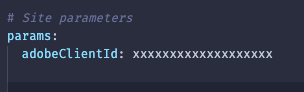
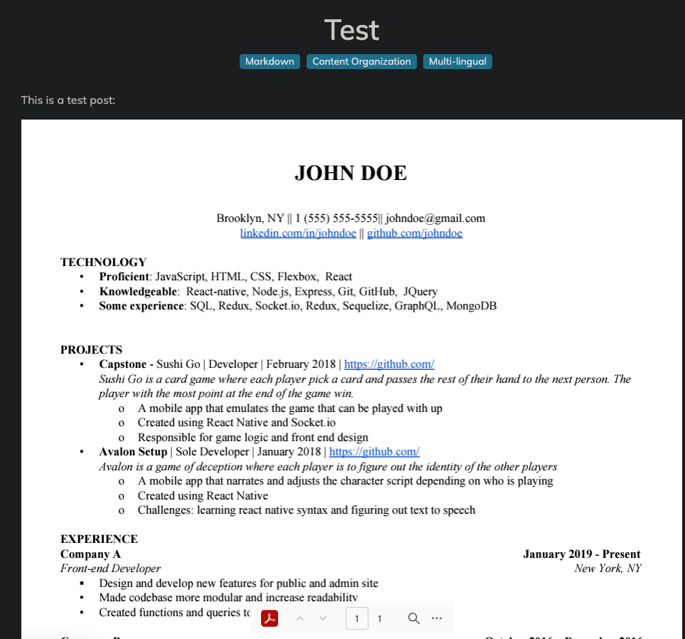
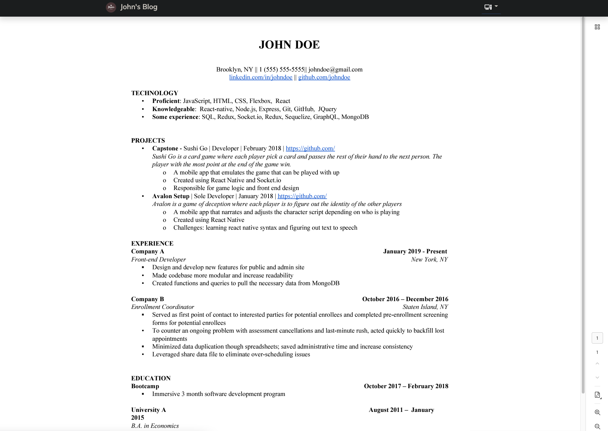

# Hugo Adobe pdf api shortcode  
---  
# Table of Contents  

* [Intro](#intro)
* [Install](#install)
* [Usage](#how-to-use)
* [Examples](#examples)

---

## Intro  
Hugo shortcode for use [PDF Embed API](https://developer.adobe.com/document-services/apis/pdf-embed/) from Adobe

For more info you can check the [api docu](https://developer.adobe.com/document-services/docs/overview/pdf-embed-aapi/)

## Install  
1. Clone the repo https://github.com/toniop99/hugo-adobe-pdf-api-shortcode
<br />


2. Copy `./layouts/shortcodes/pdf.html` to  `./layouts/shortcodes` in your Hugo project.  
<br />

3. Add adobe sdk to ypur page script html (**scripts.html** or **footer.html**)
```html
    <script type="text/javascript" src="https://documentservices.adobe.com/view-sdk/viewer.js"></script>
```

4. Create an api on [adobe developer page](https://developer.adobe.com/console/home)
    - Create an account
    - Create a project
    - Copy the API KEY (CLIENT ID) to your **config.yaml** **params**.

    


## How to use

In your Hugo website place the following shortcode in any of the markdown pages. 
```
    
```

### Parameters
- **url (required)** : The relative location of the file.  
- **fileName (optional)**: Name of the file. Default to url provided. 
- **type (optional)<FULL_WINDOW, SIZED_CONTAINER, IN_LINE OR LIGHT_BOX>**: How the pdf will be shown. Default to **IN_LINE** More info on [Adobe API Doc](https://developer.adobe.com/document-services/docs/overview/pdf-embed-api/howtos/)

### Examples
#### IN LINE

#### LightBox


